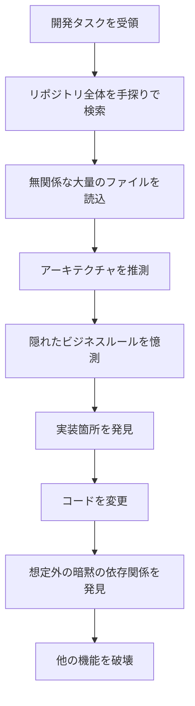
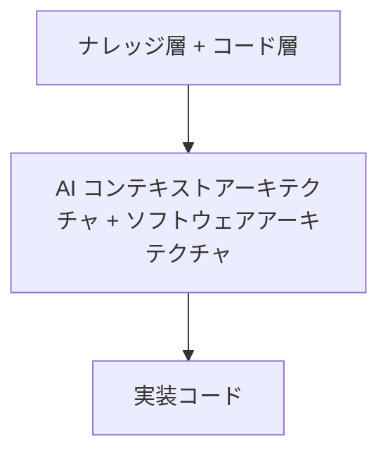
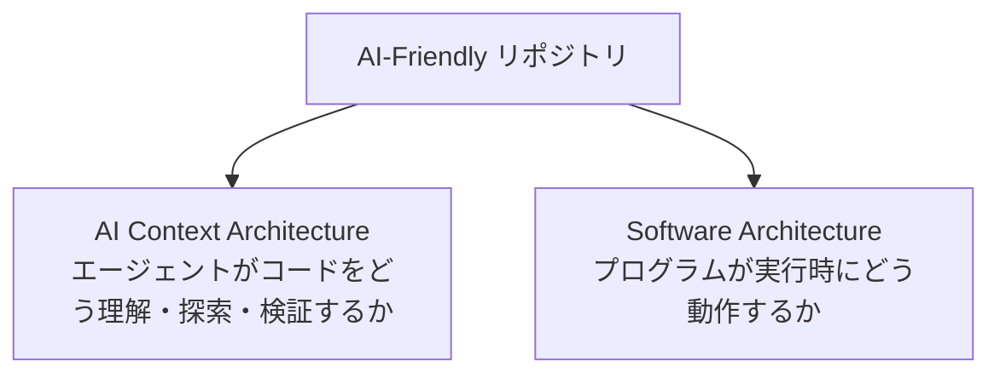
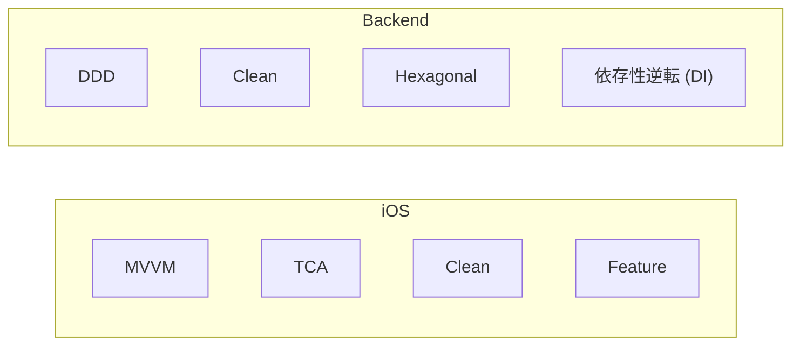
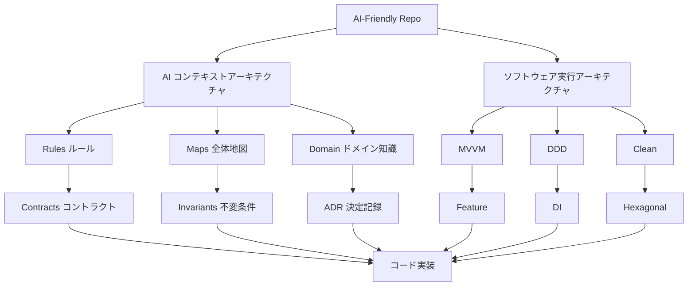
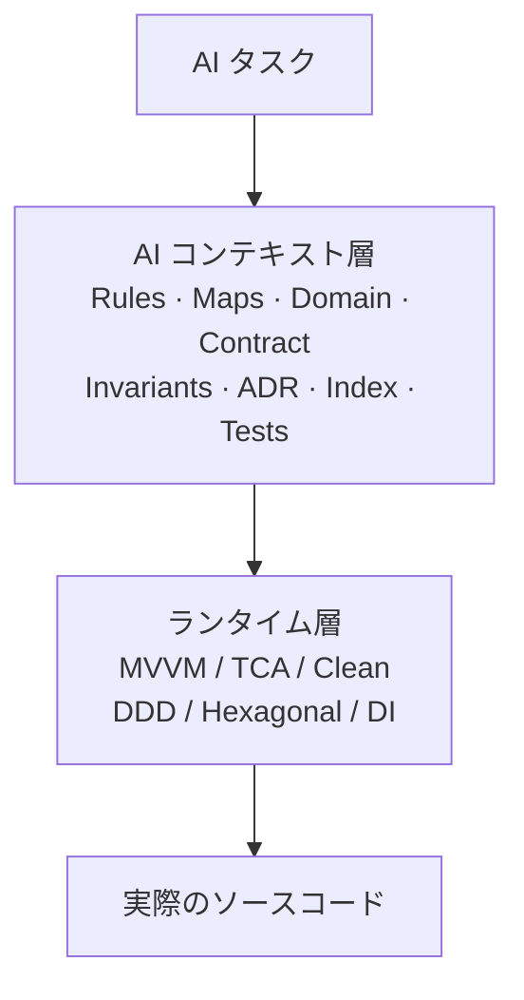
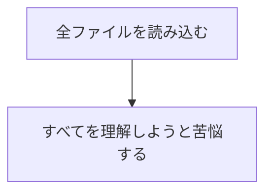
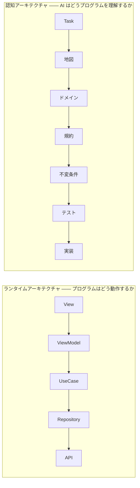

# AI-Friendly Repo

[🇬🇧 English](README.md) | [🇨🇳 简体中文](README.zh-CN.md)

> AI にコードを増やすのではなく、より良い構造を与える。

**Before（従来）:**
```text
README.md
ソースコード (Source code)
```

**After（AI 友好）:**
```text
AGENTS.md
PROJECT_MAP (プロジェクト全体図)
Context Index (コンテキストインデックス)
Domain Knowledge (ドメイン知識)
Contracts (規約・コントラクト)
Invariants (不変条件)
ADR (アーキテクチャ決定記録)
Tests (検証可能なテスト)
Dependency / Impact (依存関係と影響マップ)
ソースコード (Source code)
```
*AI エージェントが手探りで迷走することはもうありません。*

AI コーディングエージェント（Cursor、Claude Code、Windsurf など）が最小限の認知的負荷で大規模ソフトウェアを正しく理解し、ナビゲートし、変更し、保守できるように設計された実用的なリポジトリ設計仕様、ドキュメント体系、およびプロジェクトテンプレートです。

📖 **設計理念を読む：[AI-Friendly Project —— 理念](spec/philosophy.md)** ([简体中文](spec/philosophy.zh-CN.md) · [日本語](spec/philosophy.ja.md))

AI コーディングエージェントは日常的なソフトウェア開発において不可欠な存在になりつつあります。しかし、既存のほとんどのリポジトリはエージェントが登場する前に作られたものです。アーキテクチャは暗黙的で、重要なルールは散乱し、エージェントは小さな変更を加えるためだけに膨大な無関係のコードを読み込むことを強いられています。

**AI-Friendly Repo** は、AI コーディングエージェントが容易に理解・探索・変更・検証できるコードベースを構築するための、実践的なアーキテクチャ標準、ドキュメント体系、プロジェクトテンプレートです。

---

## 課題 (The Problem)

既存のリポジトリは主に人間の開発者のために最適化されています。

熟練したエンジニアならすでに知っていること：
* 重要なコードがどこにあるか
* どのサービスが特定の機能を担当しているか
* なぜそのような特殊な実装が存在するのか
* どのファイルを変更しても安全か
* どのビジネスルールを決して破ってはならないか

しかし、AI エージェントはデフォルトでこれらを**まったく知りません**。

その結果、単純なタスクでも以下のような悪循環に陥ります：



これはコンテキストウィンドウを浪費し、コストを増大させ、AI 開発の信頼性を著しく損ないます。

---

## コアコンセプト (The Idea)

> **AI-Friendly Repo は従来のソフトウェアアーキテクチャを置き換えるものではありません。** 従来の設計の上に **Agent Context Layer（エージェントコンテキスト層）** を追加するものです。

「AI 専用の新しい MVVM」ではありません。従来のアーキテクチャは陳腐化しておらず、二層のモデルとして共存します：





各プラットフォームのランタイムアーキテクチャは標準的なものをそのまま使用します：



全体アーキテクチャモデル：



タスク実行時、エージェントは「まずコンテキスト層、次にランタイム層」の順序で探索します：



詳細は [Philosophy（設計理念）](spec/philosophy.ja.md) を参照してください。

---

## 基本原則 (Core Principle)

> **小さなコンテキスト → 大きな理解 (Small Context → Large Understanding)**

すべてを一度に読み込ませるアプローチからの脱却：



本仕様では、ソフトウェアの第二の軸として **認知アーキテクチャ（Cognitive Architecture）** を定義します：



```text
ランタイムフロー (Runtime Flow)     → プログラムはどう実行されるか？
認知フロー (Cognitive Flow)         → AI はどうプログラムを理解するか？
```

---

## 利用モード (Usage Modes)

用途に応じて2つのモードから選択できます：

### Mode A: ナレッジ層のみの導入 (Knowledge-only Template)
**ユースケース**: 既存のコードベースがあり、低コストで AI 友好化したい場合。
- `template/AGENTS.md`、`template/.agents/`、`template/docs/` をプロジェクトルートにコピー。
- 既存の MVVM / DDD などのコード構造を変更する必要はありません。ナレッジ層で既存構造をマッピングします。

### Mode B: 新規プロジェクト用テンプレート (New Project Template)
**ユースケース**: クリーンな AI-Native アーキテクチャでゼロから開発を始める場合。
- `examples/mixed/`（または各言語のサンプル）の全体構成をベースに作成。
- 初日からナレッジ層とコード層が完全に分離された状態で開発できます。

---

## 今後の展望：AI-Friendly ツールチェーン

現在、AI-Friendly Repo は実用的な仕様・理念・テンプレートとして提供されています。**仕様書ではコンテキストインデックスやマップの動作仕様を定めており、自動化ツールチェーンは現在計画・設計中です。**

今後、コンテキスト管理を自動化する CLI ツール（`anr`）の開発を予定しています：
- `anr init`: 既存プロジェクトにナレッジ層を自動生成
- `anr index`: コードのシンボルから `.agents/context-index.md` を自動生成
- `anr map`: 依存関係グラフや変更影響マップを自動抽出
- `anr validate`: リポジトリが `spec/` 規範に準拠しているかを自動検証

---

# AI 友好なリポジトリの要件

## 1. プロジェクト全体図 (Repository Map)
何をするプロジェクトか、主要コンポーネントの配置、ドメイン境界、重要なエントリーポイントを簡潔に示します。

## 2. 段階的コンテキスト展開 (Layered Context)
`AGENTS.md` → `PROJECT_MAP` → `Domain / Arch` → `Contract` → `Invariants / Tests` → `Implementation` と、認知的深さに応じて段階的に展開します。

## 3. ドメイン・機能ごとの構造化 (Feature-Based)
技術種別（controllers/models）ではなく、業務ドメイン（features/voice 等）単位でコードをまとめます。

## 4. 実装より前に明確なインターフェース (Interfaces First)
重要な機能には必ず明示的な Interface / Protocol を定義します。過度な抽象化ではなく、明確な責務境界を重視します。

## 5. コントラクト (Contracts)
関数の引数・戻り値だけでなく、前提条件、エラー定義、副作用、制約を明文化します。

## 6. 不変条件 (Invariants)
「20秒の無音でセッション切断」「ネットワーク切断時はローカル処理へフォールバック」など、壊してはならない中核ルールをコードの外に明記します。

## 7. アーキテクチャ決定記録 (ADR)
「なぜその設計にしたのか」の理由とトレードオフを記録し、AI が勝手に“単純化”することを防ぎます。

## 8. テストを実行可能な知識として扱う
テストは動作確認だけでなく、仕様そのものを AI に伝える知識資産です。意味のあるテストケース名を記述します。

## 9. 依存と影響範囲の可視化
「このコンポーネントを修正すると、どこに影響が出るか」を把握可能にします。

## 10. 漸進的な情報開示 (Progressive Disclosure)
巨大な単一ファイルにすべてを詰め込まず、レイヤーごとに適切な情報を提供します。

---

# クイックスタート (Quick Start)

リポジトリのクローン：

```bash
git clone git@github.com:Armkas/AI-Friendly-Repo.git
cd AI-Friendly-Repo
```

標準仕様を確認する：

```text
spec/
```

テンプレートを確認する：

```text
template/
```

完全なサンプルプロジェクトを確認する：

```text
examples/ios/
examples/fastapi/
examples/mixed/
```

---

# ライセンス (License)

MIT
