# AI-Friendly Repo

[🇨🇳 简体中文](README.zh-CN.md) | [🇯🇵 日本語](README.ja.md)

> Don't give AI more context. Give it better structure.

A practical repository architecture for building software that is easier for AI coding agents to understand, navigate, modify, and maintain.

📖 **Read the full rationale: [AI-Friendly Project — Philosophy](spec/philosophy.md)** ([简体中文](spec/philosophy.zh-CN.md) · [日本語](spec/philosophy.ja.md))

AI coding agents are becoming a normal part of software development. But most repositories were designed before agents existed: architecture is implicit, important knowledge is scattered across files, and agents often have to read large amounts of code before they can safely make a small change.

**AI-Friendly Repo** is a practical architecture, documentation system, and project template for building repositories that are easier for AI coding agents to understand, navigate, modify, and verify.

---

## The Problem

Traditional repositories are optimized primarily for human developers.

A developer may already know:

* where the important code lives
* which service owns a feature
* why a strange implementation exists
* which files are safe to modify
* which business rules must never be broken

An AI coding agent usually does not know any of this.

So a simple task can become:

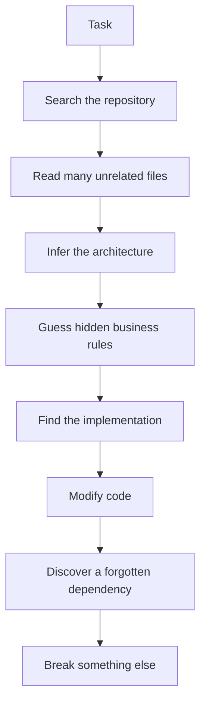

This wastes context, increases cost, and makes AI-assisted development less reliable.

---

## The Idea

> **AI-Friendly Repo does not replace traditional software architecture.** It adds an **Agent Context Layer** on top of it.

It is not “AI-MVVM”. Traditional architecture is not obsolete. The upgrade is:

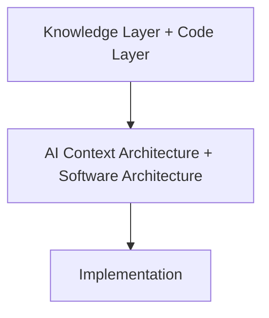

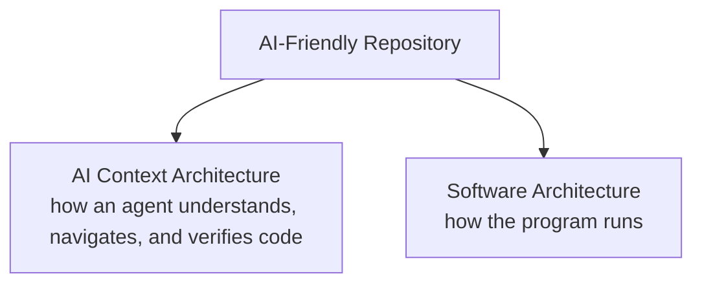

Software architecture stays conventional:

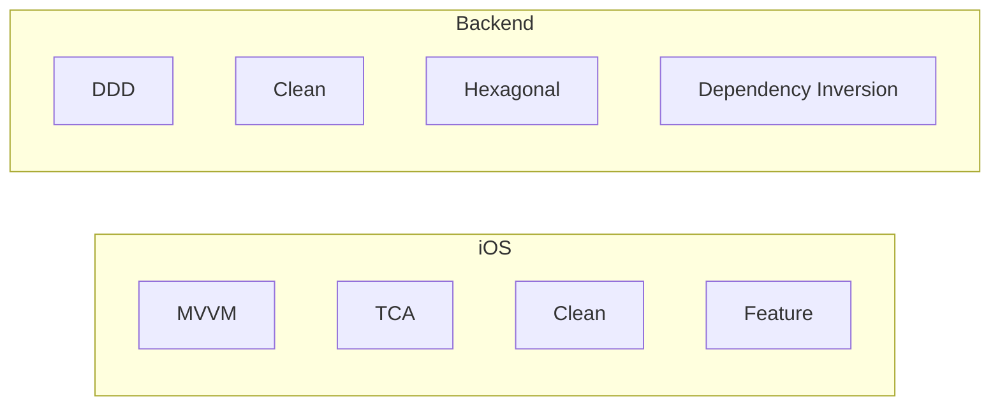

The full model:

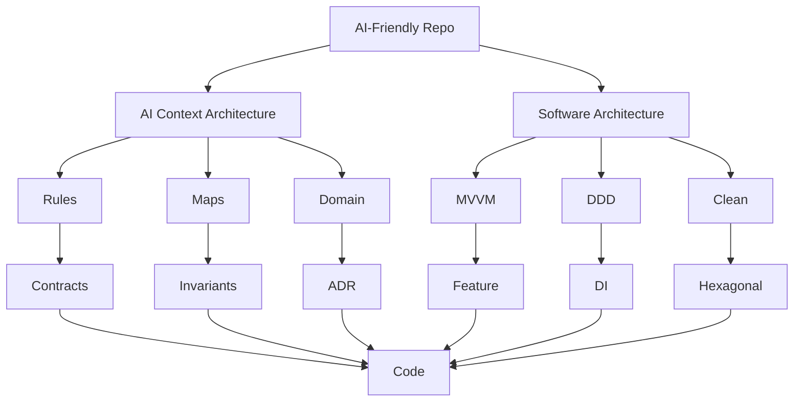

On a task, the agent walks the context layer first, then the runtime layer:

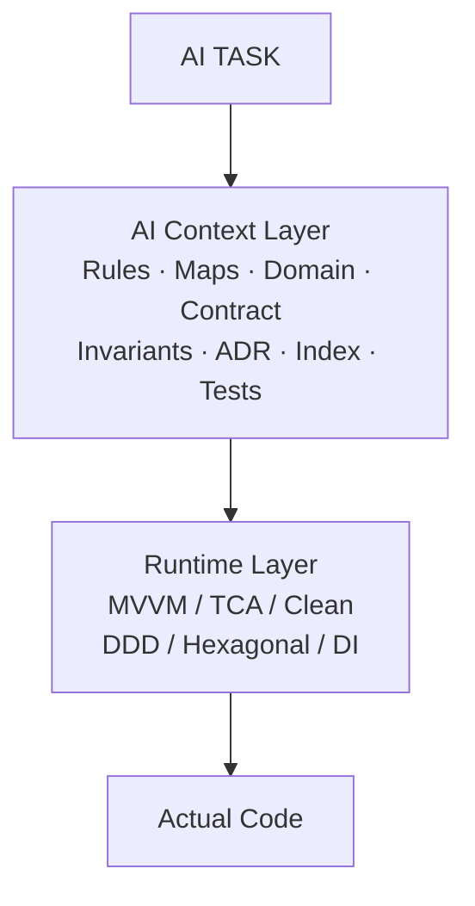

See [Philosophy](spec/philosophy.md).

---

## Core Principle

> **Small Context → Large Understanding**

Instead of:

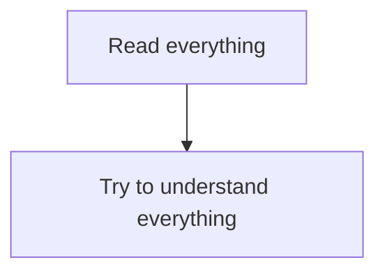

This project names a second architecture plane: **Cognitive Architecture**.

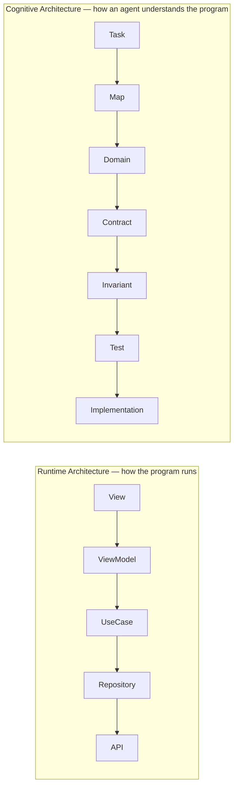

```text
Runtime Flow     →  how does the program run?
Cognitive Flow   →  how does the AI understand the program?
```

---

## Usage Modes

This repository offers two distinct usage modes depending on your needs:

### Mode A: Knowledge-only Template
**Use case**: You already have an existing codebase and only want to make it AI-Friendly.
- Copy `template/AGENTS.md`, `template/.agents/`, and `template/docs/` to your root directory.
- You don't need to replace MVVM / DDD / Clean. Map the existing runtime architecture with the knowledge layer.

### Mode B: New Project Template
**Use case**: Starting a project from scratch with an AI-Native architecture.
- Copy the entire structure from `examples/mixed/` (or your preferred platform).
- The knowledge layer and code layer are perfectly decoupled from day one.

---

## Future Vision: The AI-Friendly Toolchain
Currently, AI-Friendly Repo is a philosophy and template. The next phase is to turn it into an automated system.
We envision a CLI tool (`anr`) that will automate context management:
- `anr init`: Scaffold the knowledge layer in any existing project.
- `anr index`: Automatically generate `.agents/context-index.md` from code symbols.
- `anr map`: Auto-generate dependency graphs and impact maps.
- `anr validate`: Verify that the codebase adheres to the rules in `spec/`.


---

# What Makes a Repository AI-Friendly?

## 1. A Repository Map

Every project should have a compact map describing:

* what the project does
* where major components live
* what the major domains are
* where the important entry points are
* where to find deeper documentation

The map is a navigation layer, not a giant manual.

---

## 2. Layered Context

Information is organized by depth:

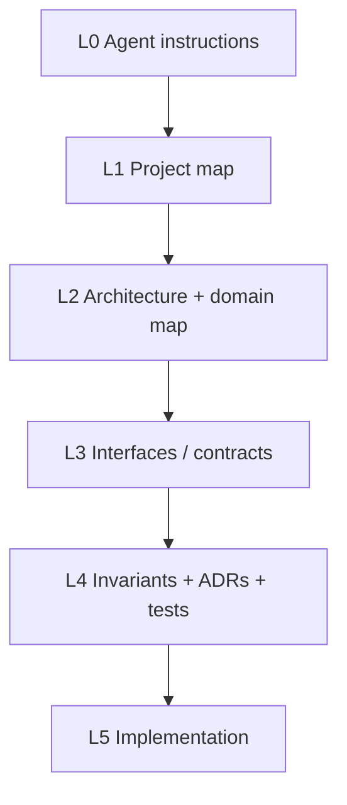

Agents expand the context only when necessary.

---

## 3. Feature-Based Architecture

Business code is organized by domain or feature rather than by technical type.

Prefer:

```text
features/
├── voice/
├── navigation/
├── account/
└── billing/
```

over:

```text
routers/
services/
models/
controllers/
utils/
```

The goal is to make a business task map to a small, coherent part of the repository.

---

## 4. Interfaces Before Implementations

Important capabilities should have explicit interfaces.

Swift:

```swift
protocol SpeechRecognizer {
    func start() async throws
    func stop() async
}
```

Python:

```python
class SpeechService(Protocol):
    async def transcribe(
        self,
        audio: bytes,
    ) -> str:
        ...
```

The interface describes what a component can do.

The implementation describes how it does it.

Agents should normally understand the interface before opening the implementation.

AI-Friendly is **not** abstraction-heavy. This is not AI-friendly:

```text
UserService
IUserService
UserServiceProtocol
BaseUserService
UserServiceFactory
UserServiceAdapter
UserServiceFacade
```

This is:

```text
one clear responsibility
        +
one clear Interface
        +
one or few Implementations
        +
clear rules
```

> **Explicit structure, not excessive abstraction.**

---

## 5. Contracts

Interfaces should describe more than method signatures.

A useful contract may specify:

```text
Responsibility
Input
Output
Errors
Side effects
Constraints
```

This gives an agent a compact and reliable model of a component.

---

## 6. Invariants

Important business rules should exist outside implementation details.

Example:

```text
20 seconds of silence ends the voice session.

Network failure must trigger fallback.

Unvalidated commands must never execute.

High-risk actions require explicit user confirmation.
```

Implementation can change.

The invariant should not change unless the product requirement changes.

---

## 7. Architecture Decision Records

Important architectural decisions should explain **why** the system works the way it does.

Example:

```text
ADR-001

Decision:
Use WebSocket as the primary voice transport.

Why:
Low latency and bidirectional communication.

Fallback:
REST streaming → local processing.

Do not replace WebSocket unless:
The latency and reliability requirements are reconsidered.
```

This prevents an AI agent from “simplifying” a deliberate architectural decision.

---

## 8. Tests as Executable Knowledge

Tests are not only verification.

They also communicate expected system behavior.

Prefer:

```text
testNetworkFailureFallsBackToLocalRecognition()
```

over:

```text
test1()
```

The agent should use:

```text
Contract
+
Invariant
+
Test
+
Implementation
```

to understand the actual behavior of the system.

---

## 9. Dependency and Impact Awareness

An AI-friendly repository should make it possible to answer:

```text
Who depends on this?

Who calls this?

What will be affected if I change this?
```

Example:

```text
VoiceService
├── SpeechService
├── LLMService
└── CommandValidator

Used by:
├── VoiceSession
└── ConversationService
```

Where possible, this information should be generated automatically.

---

## 10. Progressive Disclosure

Do not put every piece of information into one giant `AGENTS.md`.

Instead:

```text
AGENTS.md
      ↓
context index
      ↓
architecture
      ↓
domain knowledge
      ↓
contract
      ↓
implementation
```

Each layer should answer a different question.

---

# Repository Structure

A typical AI-Friendly Repo may look like:

```text
project/
│
├── README.md
├── AGENTS.md
│
├── spec/
│   └── repository-standard.md
│
├── template/
│   ├── AGENTS.md
│   ├── .agents/
│   └── docs/
│
└── examples/
    ├── ios/
    ├── fastapi/
    └── mixed/
```

The exact implementation is not mandatory. The principles are.

**AI-Friendly Repo does not prescribe a single runtime architecture.**

```text
iOS:
MVVM
TCA
Clean Architecture
Feature Architecture

Backend:
DDD
Clean Architecture
Hexagonal Architecture
Vertical Slice
```

All of these are valid. Whatever **Runtime Architecture** you choose, it must still satisfy the **AI Context Architecture**.

---

# Example Project

This repository contains a complete example project combining:

```text
iOS + FastAPI
```

Example:

```text
examples/
├── ios/
├── fastapi/
└── mixed/
```

The examples show **traditional software architecture plus an AI Context Layer**, not a replacement architecture:

### iOS (`examples/ios/`)

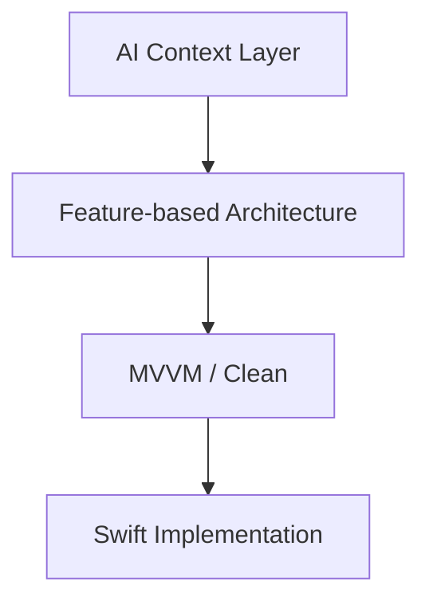

### FastAPI (`examples/fastapi/`)

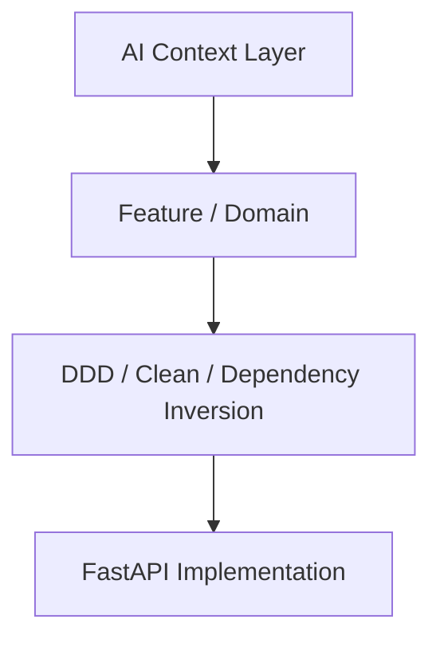

### Mixed (`examples/mixed/`)

```text
                     AI Context Layer
                            │
             ┌──────────────┴──────────────┐
             ↓                             ↓
      iOS Architecture              Backend Architecture
       MVVM / Clean                  DDD / Clean
             │                             │
             └──────────────┬──────────────┘
                            ↓
                       System Domain
```

They also demonstrate:

* Feature-based architecture
* AI-readable documentation
* Interface / implementation separation (without abstraction-for-its-own-sake)
* Domain contracts
* Business invariants
* ADRs
* Dependency mapping
* Focused testing
* AI agent workflows

---

# AI Agent Workflow

When an agent receives a task such as:

> Fix continuous voice mode when the network disconnects.

The intended workflow is:

```text
AGENTS.md
    ↓
PROJECT_MAP
    ↓
Voice Domain
    ↓
Voice Contract
    ↓
Voice Invariants
    ↓
Relevant Tests
    ↓
Dependency / Impact
    ↓
Implementation
    ↓
Focused Tests
    ↓
Integration Tests
```

The agent does not need to scan the entire repository.

---

# What This Project Is Not

AI-Friendly Repo is not:

* a replacement for Cursor
* a replacement for Claude Code
* a prompt collection
* a specific programming framework
* a single application architecture (not AI-MVVM, not a replacement for Clean / DDD)
* a requirement to use one specific AI provider
* a requirement to add more abstractions

It is a **repository design methodology**: an Agent Context Layer on top of conventional software architecture.

It can be used with different languages, frameworks, runtime architectures, and coding agents.

---

# Supported Project Types

The architecture can be used for:

```text
iOS
Android
FastAPI
Django
Node.js
Go
Rust
React
Full-stack applications
Monorepos
Libraries
CLI tools
Backend services
```

The knowledge layer remains conceptually the same.

Only the code layer changes.

---

# Design Philosophy

### 1. Structure over prompts

Prompts are temporary.

Repository structure is persistent.

### 2. Context over context window size

A larger context window does not automatically produce a better understanding of a codebase.

Good structure reduces the amount of context an agent needs.

### 3. Explicit knowledge over implicit knowledge

If an important rule exists only in the original developer's memory, the agent cannot reliably use it.

### 4. Progressive disclosure over full-code ingestion

Agents should discover information as needed.

### 5. Machine-readable where possible

Indexes, symbols, dependencies, and other structural information should be generated automatically whenever practical.

Human-written documentation should focus on intent, rules, and decisions.

### 6. AI context over a new runtime brand

Do not invent AI-MVVM. Keep MVC / MVVM / DDD / Clean / Hexagonal / TCA as Runtime Architecture. Add an AI Context Architecture so an agent can use them.

---

# Quick Start

Clone the repository:

```bash
git clone https://github.com/<your-name>/ai-friendly-repo.git
cd ai-friendly-repo
```

Explore the standard:

```text
docs/
```

Explore the templates:

```text
template/
```

Explore the complete examples:

```text
examples/ios/
examples/fastapi/
examples/mixed/
```

Copy the template into a new project and adapt:

```text
AGENTS.md
docs/
.agents/
```

Then begin development.

---

# Project Status

AI-Friendly Repo is an evolving open-source standard.

The goal is not to define a single “correct” runtime architecture.

The goal is to specify a cross-architecture **AI Context Architecture** — practical patterns that make repositories easier for both humans and AI coding agents to understand and maintain.

Contributions, experiments, examples, and alternative approaches are welcome.

---

# Contributing

We welcome contributions that improve:

* repository structure
* AI context management
* documentation patterns
* agent workflows
* language-specific examples
* architecture patterns
* testing strategies
* automated context generation

Please keep proposals general enough to be useful beyond a single AI tool.

---

# License

MIT
