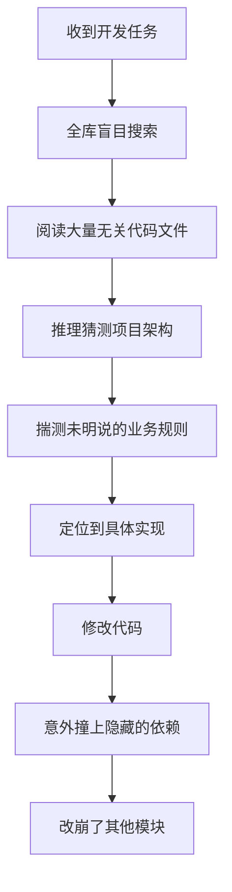
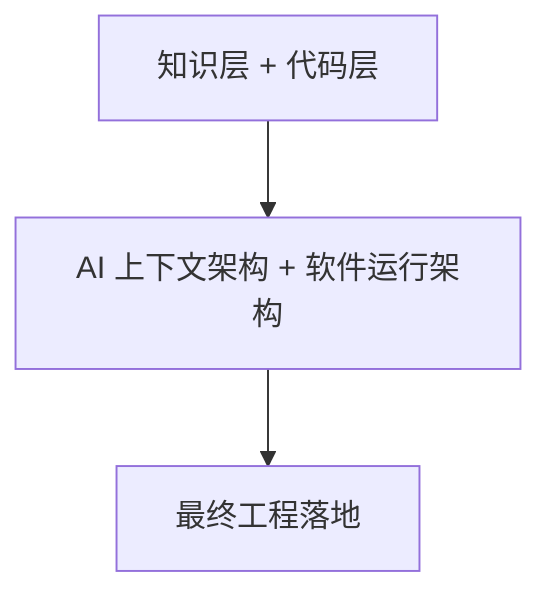
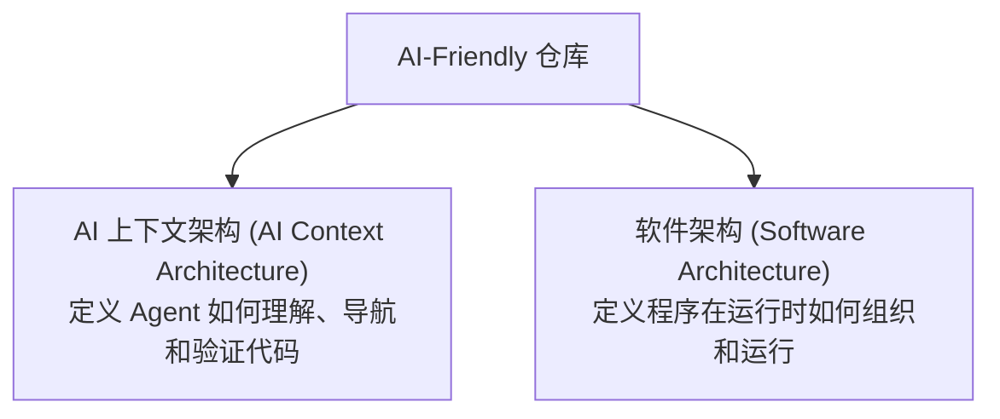
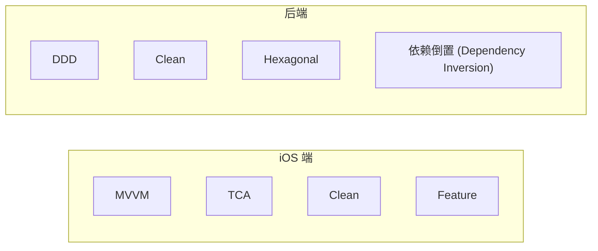
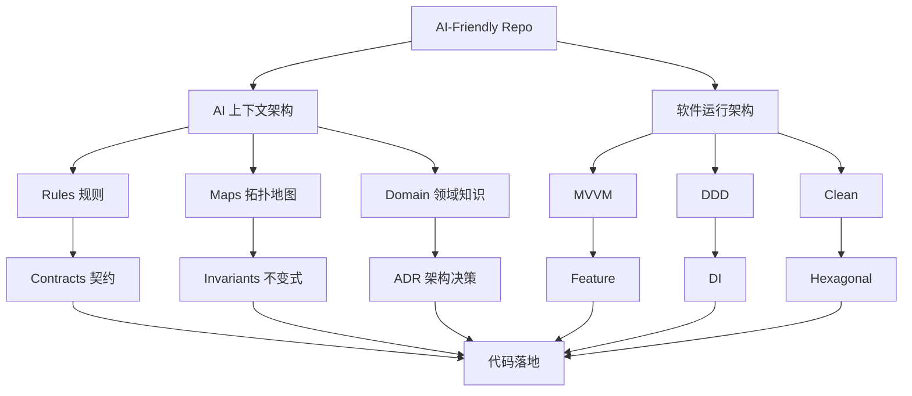
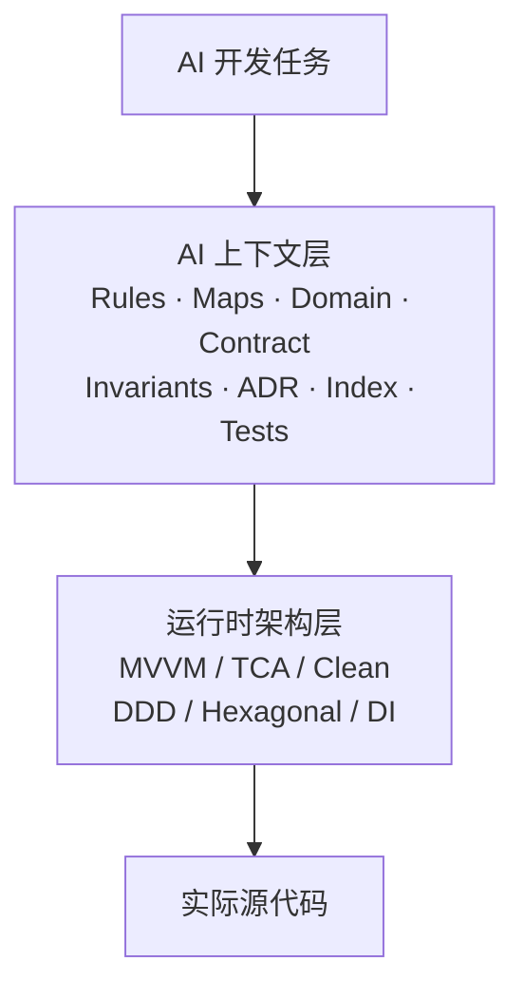
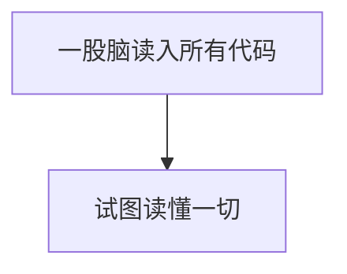
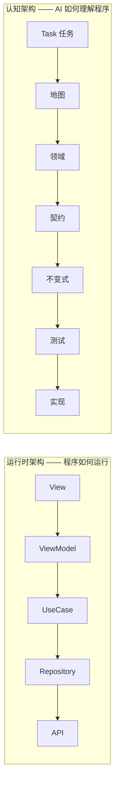
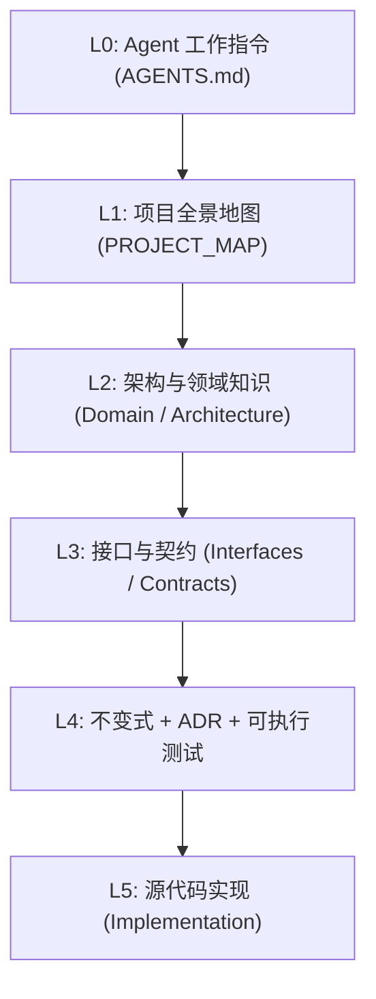

# AI-Friendly Repo

[🇬🇧 English](README.md) | [🇯🇵 日本語](README.ja.md)

> 不要给 AI 更多代码上下文，而是给 AI 更好的项目结构。

**传统模式 (Before):**
```text
README.md
源代码 (Source code)
```

**AI 友好模式 (After):**
```text
AGENTS.md
PROJECT_MAP (项目全景图)
Context Index (上下文索引)
Domain Knowledge (领域知识)
Contracts (契约)
Invariants (业务不变式)
ADR (架构决策记录)
Tests (可验证测试)
Dependency / Impact (依赖与影响图谱)
源代码 (Source code)
```
*你的 AI 编程助手将不再像无头苍蝇一样盲目探索。*

一套实用的仓库架构规范、文档体系与工程模板，旨在让 AI Coding Agent（如 Cursor、Claude Code、Windsurf 等）能够以极低的认知负载更轻松地理解、导航、修改和维护大型软件。

📖 **阅读完整设计哲学：[AI-Friendly Project —— 理念](spec/philosophy.md)** ([简体中文](spec/philosophy.zh-CN.md) · [日本語](spec/philosophy.ja.md))

AI 编程助手正在成为日常软件开发的核心成员。但绝大多数现有代码库都是在 Agent 出现之前设计的：架构往往是隐式的，关键业务规则分散在大量代码中，Agent 为了做一处微小改动，常常不得不被迫读取大量无关代码。

**AI-Friendly Repo** 是一套实用的架构规范、文档体系与项目模版，帮助你构建一个让 AI Agent 易于理解、导航、修改与验证的高效代码库。

---

## 核心痛点

传统代码库主要面向人类开发者的心智模型进行优化。

一个熟练的人类工程师可能早已清楚：
* 核心代码存放在哪里
* 哪个服务负责哪块具体业务
* 某段看似奇怪的代码实现背后有什么历史原因
* 哪些文件可以安全修改，哪些改动会牵一发而动全身
* 哪些底层业务规则绝对不能被打破

但 AI 编程助手默认对这些**一无所知**。

因此，一个简单的改动任务往往演变成这样的恶性循环：



这不仅浪费了宝贵的上下文窗口、拉高了 API Token 成本，更让 AI 辅助开发变得不可控且容易出错。

---

## 核心理念

> **AI-Friendly Repo 并不试图取代传统的软件架构。** 它是在传统架构之上叠加一层 **Agent 上下文层（Agent Context Layer）**。

它绝不是所谓的“AI 版 MVVM”。传统架构没有过时，而是形成了双层演进：





运行时的软件架构依然保持各平台业界标准：



完整架构模型如下：



当 Agent 执行任务时，遵循“先上下文层、后运行时层”的认知路径：



详见 [Philosophy 设计理念](spec/philosophy.md)。

---

## 核心法则

> **小上下文 → 大理解 (Small Context → Large Understanding)**

摒弃盲目的大上下文塞入：



本项目定义了软件的第二个维度：**认知架构（Cognitive Architecture）**。



```text
运行流 (Runtime Flow)     → 程序如何执行？
认知流 (Cognitive Flow)   → AI 如何理解该程序？
```

---

## 两种使用模式

你可以根据团队和项目的实际阶段灵活选择：

### 模式 A：轻量知识层模板 (Knowledge-only Template)
**适用场景**：已有成熟代码库，希望低成本引入 AI-Friendly 能力。
- 将 `template/AGENTS.md`、`template/.agents/` 以及 `template/docs/` 复制到工程根目录下；
- 无需推翻现有 MVVM / DDD / Clean 等业务代码；直接用知识层梳理和映射现有代码结构。

### 模式 B：全量新建项目模板 (New Project Template)
**适用场景**：从零起步构建全新的 AI-Native 原生工程。
- 直接复制 `examples/mixed/`（或对应语言平台示例）的整体目录结构；
- 从第一天起就实现知识层与代码层的清晰解耦。

---

## 未来愿景：AI-Friendly 工具链

当前 AI-Friendly Repo 是一套经过验证的规范标准与工程模版。**规范定义了上下文索引（Context Index）和拓扑地图的运作方式；自动化工具链正在规划与演进中。**

我们计划推出专用 CLI 工具（`anr`）来实现上下文资产的自动化管理：
- `anr init`：在任何现有项目中一键脚手架生成知识层；
- `anr index`：自动从代码符号提取并生成 `.agents/context-index.md`；
- `anr map`：自动生成依赖图与变更影响面分析；
- `anr validate`：自动化校验代码库是否满足 `spec/` 规范约束。

---

# 怎样才算一个对 AI 友好的仓库？

## 1. 结构清晰的项目地图 (Repository Map)

每个项目都应该有一份高度浓缩的项目全景图，清晰说明：
* 这个项目负责解决什么问题
* 各个核心模块分别放在哪里
* 业务主领域（Domain）有哪些
* 关键入口在哪里
* 到哪里查阅更深度的技术文档

地图是导航层，而不是冗长的流水账使用手册。

---

## 2. 渐进式上下文 (Layered Context)

知识按照认知深度逐级展开：



Agent 仅在必要时才按需展开下一级上下文。

---

## 3. 按业务特性组织架构 (Feature-Based Architecture)

业务代码应按业务领域（Domain/Feature）切分，而不是纯粹按技术类型扁平堆砌。

推荐：
```text
features/
├── voice/
├── navigation/
├── account/
└── billing/
```

优于：
```text
routers/
services/
models/
controllers/
utils/
```

目标是让每一次业务改动都能精准映射到仓库中一个紧凑内聚的小范围内。

---

## 4. 接口先于实现 (Interfaces Before Implementations)

核心能力必须具备显式抽象接口。

Swift 示例：
```swift
protocol SpeechRecognizer {
    func start() async throws
    func stop() async
}
```

Python 示例：
```python
class SpeechService(Protocol):
    async def transcribe(
        self,
        audio: bytes,
    ) -> str:
        ...
```

接口定义能力“能做什么”（What），实现定义具体“怎么做”（How）。Agent 通常应该先读懂接口，只有在必须修改具体逻辑时才打开具体实现。

> **强调清晰显式的结构，反对过度抽象。**（反对生造多层无意义的 Proxy/Facade/Adapter）。

---

## 5. 明确的业务契约 (Contracts)

接口应该不仅包含方法签名，还应明确定义契约要素：
* 职责边界 (Responsibility)
* 输入与前置条件 (Input)
* 输出结果 (Output)
* 错误与异常处理 (Errors)
* 副作用 (Side effects)
* 性能/安全约束 (Constraints)

这能为 Agent 建立确定性极高的逻辑认知模型。

---

## 6. 业务不变式 (Invariants)

关键业务规则必须独立于代码实现细节显式记录。

示例：
```text
持续静音达 20 秒必须主动中断语音会话。
网络断开时必须自动触发降级本地处理。
未经合法性校验的指令严禁直接执行。
高风险资金与数据操作必须要求用户显式二次确认。
```

代码实现可以不断重构演化，但除非产品需求变更，否则不变式绝不可轻易破坏。

---

## 7. 架构决策记录 (ADR)

记录架构设计背后的“为什么”（Why）：

```text
ADR-001
决策：使用 WebSocket 作为语音传输的主通道。
理由：满足全双工低延迟通信要求。
降级：REST 流式传输 → 本地离线处理。
约束：除非重新评估了延迟与稳定性指标，否则严禁擅自替换 WebSocket。
```

防止 AI Agent 在不了解设计背景的情况下“过度简化”掉关键设计。

---

## 8. 将测试视作可执行的知识资产 (Tests as Executable Knowledge)

单元与集成测试不仅是验证手段，更是最精准的预期行为说明书。

优先使用可读语义的命名：
```text
testNetworkFailureFallsBackToLocalRecognition()
```
而不是：
```text
test1()
```

---

## 9. 依赖与影响面感知 (Dependency & Impact Awareness)

代码库应能清晰回答三个核心问题：
* 谁依赖了这个组件？
* 这个组件调用了谁？
* 如果我修改了它，会影响到哪些周边模块？

---

## 10. 渐进式呈现 (Progressive Disclosure)

不要把所有信息一股脑塞进单一的 `AGENTS.md`。

```text
AGENTS.md (入口约定)
      ↓
Context Index (符号与索引)
      ↓
Architecture (分层与边界)
      ↓
Domain Knowledge (领域业务逻辑)
      ↓
Contract (接口契约)
      ↓
Implementation (具体实现代码)
```

每一层回答不同维度的认知问题。

---

# 典型仓库目录结构

一个标准的 AI-Friendly 仓库大致如下：

```text
project/
│
├── README.md        # 开发者入口说明
├── AGENTS.md        # AI Agent 认知入口契约
│
├── spec/            # 规范与法则 (AI-Friendly 标准规范)
│   ├── repository-standard.md
│   ├── philosophy.md
│   ├── philosophy.zh-CN.md
│   └── philosophy.ja.md
│
├── template/        # 可开箱即用的脚手架模板
│   ├── AGENTS.md
│   ├── .agents/
│   └── docs/
│
└── examples/        # 多语言完整实战参考
    ├── ios/         # iOS (Feature + MVVM / Clean)
    ├── fastapi/     # FastAPI (Feature + DDD / Clean / DI)
    └── mixed/       # 跨端综合架构示例
```

---

# 快速开始 (Quick Start)

克隆本仓库：

```bash
git clone git@github.com:Armkas/AI-Friendly-Repo.git
cd AI-Friendly-Repo
```

查阅核心规范标准：

```text
spec/
```

查阅脚手架模板：

```text
template/
```

查阅完整实战示例工程：

```text
examples/ios/
examples/fastapi/
examples/mixed/
```

将模板复制到你的项目中开始改造：

```text
cp -r template/AGENTS.md template/.agents template/docs <你的项目路径>/
```

---

# 开源协议 (License)

MIT
