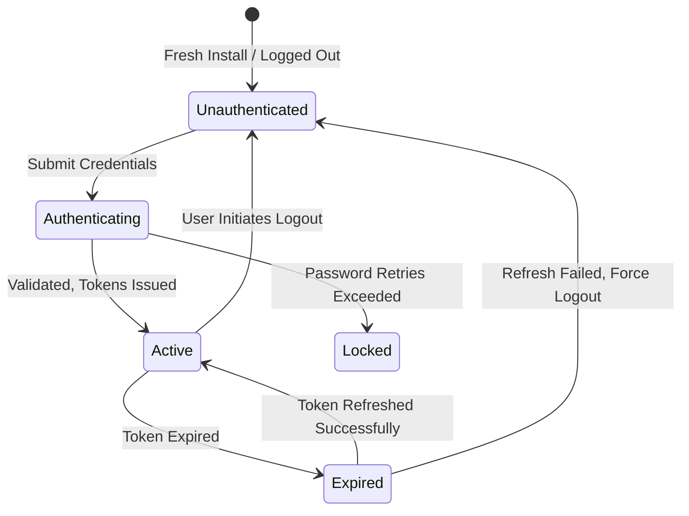

# Domain Knowledge: Authentication & User Identity (auth.md)

> **Domain Scope**: Responsible for user registration, authentication, session tokens, and third-party login providers (Sign in with Apple, Google, OAuth).

---

## 1. Ubiquitous Language & Core Entities

- **User / Profile**: Core user identity entity with unique `user_id`.
- **Session / Token**: Valid interaction credential between client and server (Access Token and Refresh Token).
- **Role / Permissions**: User authorization levels (regular user, VIP, admin) and action permissions.

---

## 2. State Machine & Lifecycle

---

## 3. Business Flows & Edge Cases

1. **Session Lifecycle**:
   - Clients send `Authorization: Bearer <token>` on all authenticated requests;
   - Gateway validates JWT signature;
   - On 401 Unauthorized, client attempts silent refresh; if refresh fails, client clears local credentials and routes to login.
2. **Security Invariants**:
   - Lock account temporarily (15 minutes) after 5 consecutive failed password attempts;
   - Account deletion is permanent; must require confirmation and purge personal data per privacy regulations.

---

## 4. Code & Contract Mappings
- **Core Interface**: `src/features/auth/interface/`
- **RPC Contracts**: [docs/contracts/backend_rpc.md](../contracts/backend_rpc.md)
- **Business Invariants**: [docs/invariants/business_invariants.md](../invariants/business_invariants.md)
