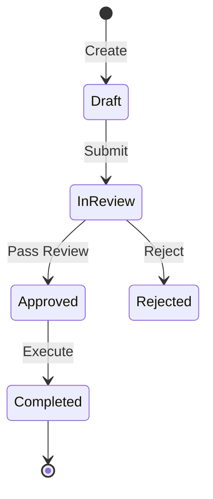

# Domain Knowledge Template: [Domain Name]

> **Domain Scope**: Brief summary of this domain's role and business objectives.

---

## 1. Ubiquitous Language & Core Entities
- **Entity A**: [Definition and responsibility]
- **Term B**: [Definition and business context]

---

## 2. State Machine & Lifecycle

---

## 3. Business Flows & Edge Cases
1. **Standard Flow**:
   - User triggers action -> Preconditions validated -> Domain service invoked -> Persistence -> Event dispatched.
2. **Edge Cases & Degradation**:
   - Fallback policy when remote services fail or timeout;
   - Compensation logic for distributed transactions.

---

## 4. Code & Contract Mappings
- **Core Interface**: `src/features/[domain]/interface/`
- **RPC Contracts**: [docs/contracts/backend_rpc.md](../contracts/backend_rpc.md)
- **Business Invariants**: [docs/invariants/business_invariants.md](../invariants/business_invariants.md)
