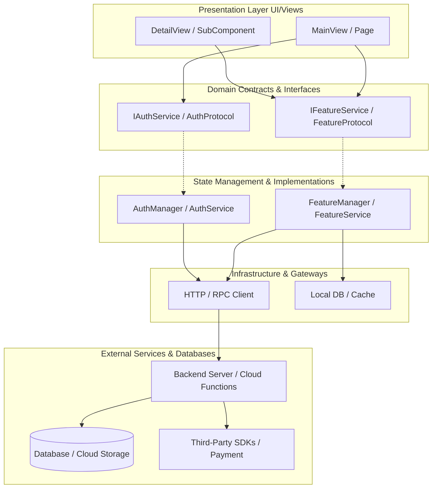

# 🗺️ Dependency & Impact Map (dependency-map.md)

[简体中文](dependency-map.zh-CN.md)

> [!NOTE]
> This document visualizes the dependencies between UI components, domain services, infrastructure, and external platforms.
> Before making major modifications, AI Agents **must review this document to evaluate the Impact Radius**, preventing unintended cross-module regressions.

---

## 1. System Topology Graph

---

## 2. Impact Radius Evaluation Checklist

Before modifying any critical component, cross-check against this list:

### 1) Modifying Core Domain Interfaces (Interface / Protocol)
- **Direct Impact**: All views, controllers, and mocks depending on this interface.
- **Required Actions**:
  - [ ] Implement new or altered methods across all implementing classes;
  - [ ] Run static type checking (e.g., `npm run typecheck` or `swift build`);
  - [ ] Update [context-index.md](context-index.md).

### 2) Modifying Backend API / RPC Inputs or Outputs
- **Direct Impact**: API clients, request/response models, and error handling across web/mobile clients.
- **Required Actions**:
  - [ ] Update [docs/contracts/backend_rpc.md](../docs/contracts/backend_rpc.md);
  - [ ] Check caller methods across all client applications;
  - [ ] Verify backward compatibility (ensure legacy clients will not crash).

### 3) Modifying Database Schemas & Migrations
- **Direct Impact**: Backend ORM models, SQL queries, and frontend entity mappings.
- **Required Actions**:
  - [ ] Append a new timestamped migration file; never mutate historical migrations;
  - [ ] Update [docs/contracts/database_schema.md](../docs/contracts/database_schema.md);
  - [ ] Assess default values and backfill strategies for existing production rows.
