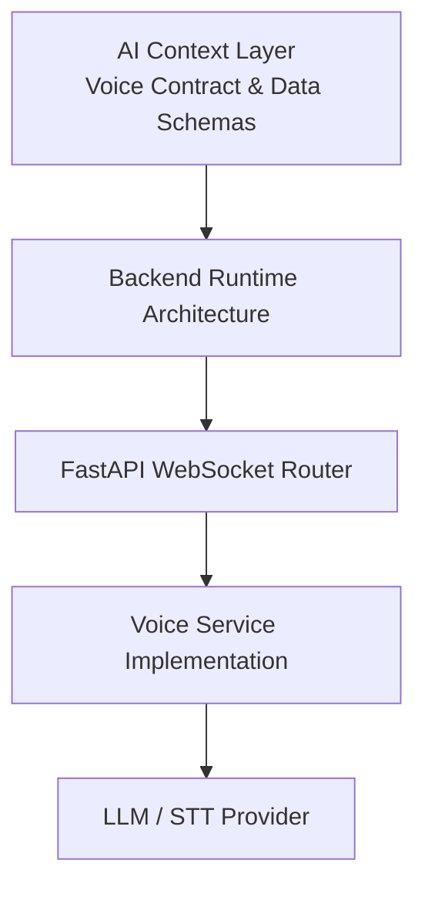

# Voice Feature: Cross-Platform Flow

This document demonstrates how the `Voice` domain flows across the `AI Context Layer` and down into the platform-specific `Runtime Layer` (iOS and FastAPI).

## 1. AI Context Layer (Cross-Platform)

At the highest level, the **AI Context Architecture** specifies the rules for the `Voice` domain. These are true regardless of whether you are reading Swift or Python code:

- **Contracts:** Audio chunks are sent to the backend; intents are returned.
- **Invariants:** 20 seconds of silence stops the session; Network degradation falls back to local STT.

## 2. Platform Implementations (Runtime Layer)

The abstract rules are fulfilled differently depending on the platform's runtime architecture.

### iOS (MVVM / Clean)

```mermaid
flowchart TB
  A[AI Context Layer<br/>Voice Protocol & Invariants] --> B[iOS Runtime Architecture]
  B --> C[VoiceViewModel]
  C --> D[VoiceClient (Implementation)]
  D --> E[URLSession / WebSocket]
```

- The `VoiceClientProtocol` defines the explicit contract.
- The `VoiceClient` implements the networking details.
- Tests verify the invariants locally.

### Backend (DDD / FastAPI)



- The `schemas.py` defines the data contract (`AudioChunk`, `VoiceIntent`).
- The `protocols.py` defines the behavior contract.
- The concrete implementations process the stream and return intents.

## Summary

By preserving the `AI Context Layer`, an AI agent can read this flow and understand *both* sides of the system without having to blindly trace through `URLSession` on iOS and `FastAPI` routes on the backend.
