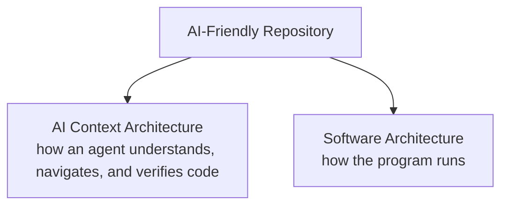
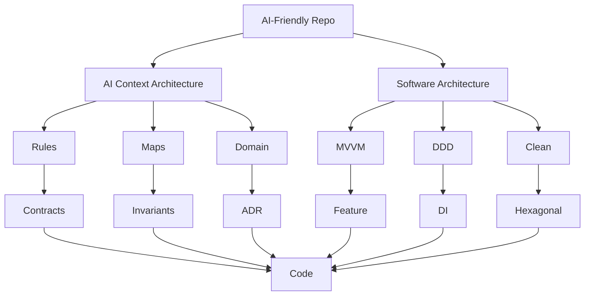
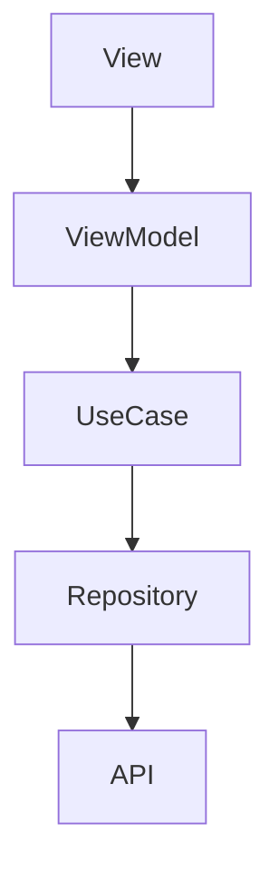
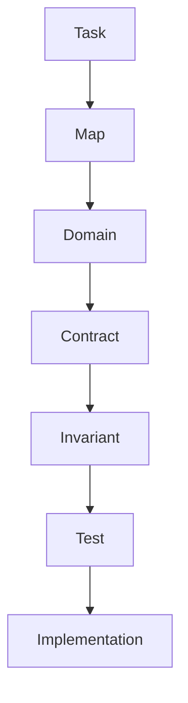

# AI-Friendly Repo Standard 1.0

## Repository Design Specification for AI Coding Agents

> For the reasoning behind these rules, see [Philosophy](philosophy.md)
> ([简体中文](philosophy.zh-CN.md) · [日本語](philosophy.ja.md)).

---

# 0. Architecture Model

This standard specifies an **AI Context Architecture**. It does **not** specify a single **Runtime Architecture**.





Existing artifacts in this spec belong to **AI Context Architecture**:

```text
Map
Domain
Contract
Invariant
ADR
Index
Test
```

These belong to **Software Architecture** (chosen per project, not prescribed):

```text
MVVM
Clean Architecture
DDD
Hexagonal
Repository
DI
```

**Runtime Architecture** — how the program runs:



**Cognitive Architecture** — how an agent understands the program:



```text
Runtime Flow     →  how does the program run?
Cognitive Flow   →  how does the AI understand the program?
```

**AI-Friendly Repo does not prescribe a single runtime architecture.**

```text
iOS:
MVVM
TCA
Clean Architecture
Feature Architecture

Backend:
DDD
Clean Architecture
Hexagonal Architecture
Vertical Slice
```

Whatever Runtime Architecture you choose, it must still satisfy the AI Context Architecture.

Rules 01–39 below implement the AI Context Architecture. They do not replace MVC / MVVM / DDD.

---

# I. Tiered Adoption (Context Depth)

Not every project requires every rule. AI-Friendly Repositories should scale their context depth based on project size.

## Rule 01 — Adopt context standards progressively
### Minimal Standard
Small projects or initial migrations should focus on:
- **`AGENTS.md`** (Router)
- **`PROJECT_MAP.md`** (Structure)

### Standard
Medium projects should add feature-focused layers:
- **`DOMAIN`** (Domain Knowledge)
- **`CONTRACT`** (Interfaces)
- **`TEST`** (Executable behavior)

### Large Standard
Complex, enterprise systems require the full AI Context Architecture:
- **`ADR`** (Architecture Decisions)
- **`DEPENDENCY`** / **`IMPACT`** (Maps)
- **`CONTEXT INDEX`** (Generated references)
- **`AGENT WORKFLOWS`** (Specialized tasks/guardrails)

---

# II. Core Principles

## Rule 02 — Repositories must be divided into a "Knowledge Layer" and a "Code Layer"

The Knowledge Layer **is** the AI Context Architecture. The Code Layer holds Software Architecture plus implementation:

```text
Repository
├── Knowledge Layer              AI Context Architecture
│   ├── Agent Rules
│   ├── Project Map
│   ├── Architecture
│   ├── Domain Knowledge
│   ├── Contracts
│   ├── Invariants
│   ├── ADRs
│   └── Generated Index
│
└── Code Layer                   Software Architecture + Implementation
    ├── iOS
    ├── Backend
    ├── Web
    ├── Worker
    └── Other Components
```

- **Knowledge Layer**: Explains what the project is, why it's designed this way, where things are, and the rules.
- **Code Layer**: The runtime architecture (MVVM, DDD, Clean, …) and the concrete implementations.

---

# III. Progressive Disclosure

## Rule 03 — AI must adopt a hierarchical reading strategy

Standard reading order:
`AGENTS.md` → `PROJECT_MAP` → `DOMAIN_MAP` / `Architecture` → `Interface` / `Contract` → `Invariant` / `ADR` / `Tests` → `Implementation`
Only proceed to the next level when the current level provides insufficient information.

## Rule 04 — Implementation is not "default correct", but "default unexpanded"
By default, prioritize Interfaces, Contracts, Architecture, Domains, and Tests over Implementations.
However, AI should actively drill down into the implementation when:
- The contract cannot explain the issue
- Tests fail
- Behavior contradicts documentation
- Dependency relationships are abnormal
- There is suspicion of a bug in the implementation
- The implementation explicitly needs modification

---

# IV. AI Instructions

## Rule 05 — The root directory must have an `AGENTS.md`
`AGENTS.md` is the agent's working contract for the entire repository. It serves as a router to guide the AI, not a giant encyclopedia.

## Rule 05 — Platforms/sub-projects can have their own `AGENTS.md`
Root rules apply repository-wide. Sub-rules (e.g., `backend/AGENTS.md`) apply to that directory and its subdirectories. AI context is stacked based on the directory hierarchy.

---

# IV. Project Map

## Rule 06 — A Project Map must exist
Typically located at `docs/PROJECT_MAP.md`, answering only "What is the entire project, and where are things located?"

## Rule 07 — The Project Map must be concise
Aim for 100 lines instead of 500. Its goal is to quickly build global awareness, not to replace all documentation.

---

# V. Context Index

## Rule 08 — A machine/AI readable Context Index must exist
Typically `.agents/context-index.md`. It answers "Where exactly is this specific item located?"

## Rule 09 — Context Index information should be auto-generated where possible
File locations, symbols, dependencies, and test links should ideally be generated. Human maintenance should focus on business meaning, architectural intent, invariants, and ADRs.

---

# VI. Feature-Based Organization

## Rule 10 — Use Vertical Slice / Feature-based Architecture
Organize code by feature (e.g., `features/voice/`, `features/navigation/`) rather than technical type (`routers/`, `services/`, `models/`).
This is an AI context boundary. It sits **inside** the chosen runtime architecture (MVVM, DDD, Clean, …); it does not replace that architecture.

## Rule 11 — The Feature is the primary context boundary for AI
An AI working on a task should find most of the relevant interfaces, application logic, infrastructure, APIs, and tests within that feature's boundary.

---

# VII. Interface / Contract

## Rule 12 — Business capabilities must prioritize Interface definitions
Use `protocol` in Swift, `typing.Protocol` in Python, or equivalent abstractions.

## Rule 13 — Interfaces must describe Contracts, not just function signatures
Interfaces must document responsibilities, inputs, outputs, errors, side effects, and critical constraints (e.g., "Must not expose provider-specific exceptions").

## Rule 14 — API Schemas and Domain Interfaces must be separated
Do not mix network boundaries (Requests/Responses) with domain boundaries (Services/Repositories).

---

# VIII. Implementation

## Rule 15 — Implementations should sit at clear Infrastructure/Implementation boundaries
Keep concrete implementations (e.g., `OpenAISpeechService`) separate from application logic and interfaces (`SpeechService`).

---

# IX. Domain Knowledge

## Rule 16 — Every important business domain must have domain documentation
e.g., `docs/domains/voice.md`. Must explain responsibilities, inputs, outputs, capabilities, dependencies, data flow, state machines, and related interfaces/tests.

---

# X. Invariants

## Rule 17 — Business rules (Invariants) must be separated from Implementation
Rules like "Network failure → fallback" or "High-risk action → explicit confirmation" must be explicitly documented (e.g., `docs/INVARIANTS.md`), not just hidden in code.

## Rule 18 — Invariants have higher priority than Implementation
Implementations can change; invariants cannot be broken casually without explicit product requirement changes.

---

# XI. ADR (Architecture Decision Records)

## Rule 19 — Important architectural decisions must have ADRs
Every ADR must explain the problem, the decision, why it was chosen, rejected alternatives, trade-offs, and conditions for future changes.

## Rule 20 — ADRs answer "Why"
Implementation = How. Interface = What it can do. Invariant = What must not break. ADR = Why it was designed this way.

---

# XII. Dependency & Impact Maps

## Rule 21 — Must be able to answer "Who depends on whom"
Dependency relationships between components must be documented or auto-generated.

## Rule 22 — Must be able to answer "Who uses this"
Usage relationships must be documented or auto-generated.

## Rule 23 — Must be able to answer "What does modifying this affect"
Change impact radiuses should be easily discoverable to help AI estimate the scope of modifications.

---

# XIII. Naming

## Rule 24 — Symbol names must have business meaning
Avoid generic names like `Manager`, `Helper`, `Utils` unless specifically appropriate. Names act as AI search indices.

---

# XIV. File Boundaries

## Rule 25 — Huge God Files are forbidden
Files should have a clear, single responsibility to prevent context overflow and confusion.

---

# XV. Tests

## Rule 26 — Tests must become one of AI's sources of truth
System behavior is defined by: Contract + Invariant + Test + Implementation.

## Rule 27 — Test names must express business behavior
E.g., `testNetworkFailureFallsBackToLocalRecognition()` instead of `test1()`.

## Rule 28 — Test locally first, but always verify globally
AI workflows should start with relevant unit tests, expand to integration tests, and run full test suites when necessary.

---

# XVI. Generated Files

## Rule 29 — Generated content must be separated from the Source of Truth
Generated files (e.g., in a `generated/` dir) must be marked `DO NOT EDIT`. Only the source is maintained.

---

# XVII. AI Rules / Skills / Workflows

## Rule 30 — General rules, workflows, and domain knowledge should be separated
Store them logically under `.agents/` (e.g., `skills/`, `workflows/`, `guardrails/`).

---

# XVIII. New Additions (v1.1)

## Rule 35 — Documentation is a Routing Layer, Not the Source of Executable Truth
Documentation exists to guide the AI to the right place quickly. It is not a second copy of the code.
To understand the *actual* behavior, the hierarchy of truth is:
1. Executed Test / Actual System Behavior
2. Current Implementation
3. Contract
4. Documentation
5. Comments

## Rule 36 — Context Budget
Every knowledge layer should be designed to answer one specific class of questions with minimal context.
The default context should remain small. Large files should not be treated as the default source of project understanding.
Recommended (but flexible) budgets:
- **L0 (AGENTS)**: < 2KB
- **L1 (Project Map)**: < 10KB
- **L2 (Domain)**: Domain-specific, concise
- **L3 (Interface/Contract)**: Highly targeted
- **L4/L5**: Fetched on demand as needed

## Rule 37 — This standard does not prescribe a single runtime architecture
AI-Friendly Repo does not invent AI-MVVM or replace Clean Architecture / DDD. Any runtime architecture is valid if the AI Context Architecture can still locate, constrain, and verify changes.

## Rule 38 — Explicit structure, not excessive abstraction

AI-Friendly ≠ Abstraction-Heavy.

Not this:

```text
UserService
IUserService
UserServiceProtocol
BaseUserService
UserServiceFactory
UserServiceAdapter
UserServiceFacade
```

This:

```text
one clear responsibility
        +
one clear Interface
        +
one or few Implementations
        +
clear rules
```

> Explicit structure, not excessive abstraction.