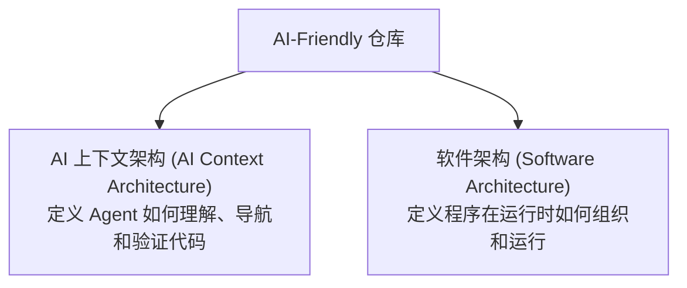
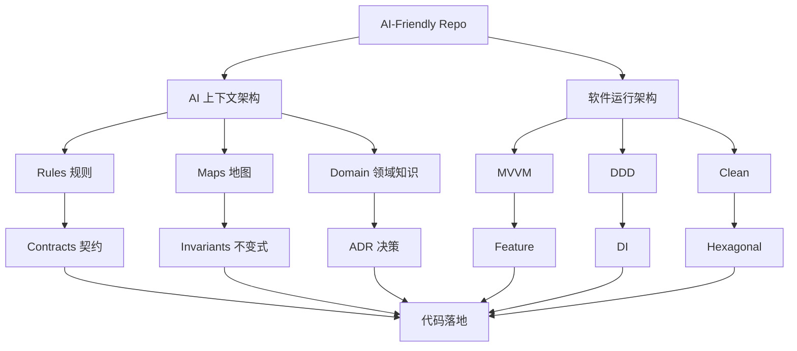

# AI-Friendly Repo Standard 1.0 (简体中文)

[🇬🇧 English](repository-standard.md)

## 面向 AI 编程代理的仓库设计规范标准

> 设计规则背后的深度思考与哲学，请参阅 [Philosophy 设计哲学](philosophy.zh-CN.md)
> ([English](philosophy.md) · [日本語](philosophy.ja.md))。

---

# 0. 架构模型 (Architecture Model)

本标准定义的是 **AI 上下文架构 (AI Context Architecture)**，**绝不限定单一的软件运行时架构 (Runtime Architecture)**。





本规范所包含的知识构件属于 **AI 上下文架构**：
```text
Map (地图)
Domain (领域)
Contract (契约)
Invariant (业务不变式)
ADR (架构决策)
Index (索引)
Test (验证测试)
```

以下模式属于 **软件运行时架构**（由各具体项目自行技术选型，本规范不做强行绑定）：
```text
MVVM
Clean Architecture
DDD (领域驱动设计)
Hexagonal (六边形架构)
Repository
DI (依赖注入)
```

```text
运行流 (Runtime Flow)     → 程序如何执行？
认知流 (Cognitive Flow)   → AI 如何理解该程序？
```

---

# I. 分级采用标准 (Tiered Adoption)

## Rule 01 — 渐进式采用上下文标准
- **基础标准 (Minimal)**：小项目或初期迁移，优先构建 `AGENTS.md`（路由入口）与 `PROJECT_MAP.md`（宏观结构）；
- **标准级 (Standard)**：中型项目增加以特性为中心的层级：`DOMAIN`（领域知识）、`CONTRACT`（接口契约）、`TEST`（可验证测试）；
- **完整企业级 (Large Standard)**：引入完整上下文体系：`ADR`、`DEPENDENCY/IMPACT`、`CONTEXT INDEX`、`AGENT WORKFLOWS`。

---

# II. 核心原则 (Core Principles)

## Rule 02 — 仓库必须划分为“知识层”与“代码层”
- **知识层 (Knowledge Layer)**：即 AI 上下文架构，解释项目是什么、为什么这样设计、各模块在哪、以及开发红线；
- **代码层 (Code Layer)**：具体的软件运行时架构与实现代码。

---

# III. 渐进式披露 (Progressive Disclosure)

## Rule 03 — AI 必须采用分层阅读策略
标准阅读次序：
`AGENTS.md` → `PROJECT_MAP` → `Domain` / `Architecture` → `Interface` / `Contract` → `Invariant` / `ADR` / `Tests` → `Implementation`。只有当前层级信息不足以解决问题时，才下钻到下一层。

## Rule 04 — 实现代码“默认不展开”，而非“默认正确”
默认优先阅读接口、契约、架构与测试。但当测试失败、契约无法解释、行为异常或明确需要改动时，主动下钻查看实现。

---

# IV. AI 代理工作指令 (AI Instructions)

## Rule 05 — 根目录必须有 `AGENTS.md`
作为全库 Agent 的单一权威工作合同与路由入口，而不是冗长的百科全书。

## Rule 05.1 — 平台或子项目可拥有独立的局部 `AGENTS.md`
根规则全局生效，子目录规则（如 `backend/AGENTS.md`）局部生效，上下文基于目录层级叠加。

---

# V. 组织与工程规范 (Rules 06–35)

- **Rule 06 — 必须存在项目全景图 (`docs/PROJECT_MAP.md`)**
- **Rule 07 — 项目全景图必须高度浓缩（建议 100 行内）**
- **Rule 08 — 必须存在机器可读的上下文索引 (`.agents/context-index.md`)**
- **Rule 10 — 必须采用垂直切片/按特性组织架构 (Feature-Based)**
- **Rule 11 — Feature 是 AI 的主要上下文边界**
- **Rule 12 — 业务能力必须接口先行 (Interface First)**
- **Rule 13 — 接口必须描述契约要素（职责、输入、输出、错误、副作用与约束）**
- **Rule 14 — API Schemas 与领域 Interface 必须分离**
- **Rule 16 — 每个核心业务域必须有领域文档 (`docs/domains/`)**
- **Rule 17 — 业务规则（Invariants）必须独立于实现代码存在**
- **Rule 18 — Invariants 的优先级高于具体实现**
- **Rule 19 — 重要技术选型必须沉淀 ADR 记录**
- **Rule 20 — ADR 负责回答“为什么 (Why)”**
- **Rule 21–23 — 必须能清晰感知依赖拓扑与改动影响半径 (Impact Radius)**
- **Rule 25–26 — 严禁巨型上帝文件，控制单个文件认知体积**
- **Rule 27–29 — 测试是可执行知识资产；AGENTS.md 必须声明明确的闭环验证命令**
- **Rule 30 — 生成文件必须与单一真理来源 (SoT) 分离**
- **Rule 31 — 通用规则、工作流 SOP 与领域知识必须在 `.agents/` 中清晰分治**
- **Rule 32 — 必须配置根级 `.agentsignore` 隔离噪音并保护 Token 预算**
- **Rule 33 — 确立以 `AGENTS.md` 为真理源、外挂轻量适配器 (`CLAUDE.md`, `GEMINI.md`) 的多 Agent 协作体系**
- **Rule 34 — 设立 `MANUAL_TASKS.md` 清晰划定 AI 自动化与人类专属操作的职责边界**
- **Rule 35 — 沉淀黄金特性样板 (`golden_feature_template.md`) 并执行文档防腐化自检机制 (Doc-Sync)**
- **Rule 36 — 文档是引导路由层，而非可执行代码的重复拷贝**
- **Rule 37 — 保持严格的上下文预算 (Context Budget)**
- **Rule 38 — 本标准不强制绑定单一运行时架构**
- **Rule 39 — 强调清晰显式的结构，反对过度冗余的抽象**
