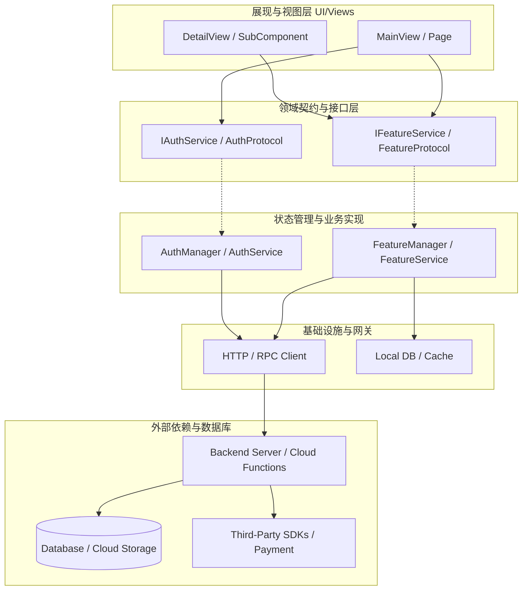

# 🗺️ 依赖与影响图谱 (Dependency & Impact Map)

> [!NOTE]
> 本文件描述了项目核心组件、服务以及外部基础设施之间的依赖关系拓扑图。
> AI 代理在修改核心模块前，**必须查阅本文件评估影响半径 (Impact Radius)**，防止改动引发非预期的跨模块破坏。

---

## 1. 系统核心依赖拓扑 (System Topology)

---

## 2. 影响范围评估清单 (Impact Radius Evaluation)

在修改以下任一核心节点前，必须对照本清单评估并自检受影响的周边文件：

### 1) 修改核心领域接口 (Domain Interface / Protocol)
- **直接影响**：所有依赖该接口的 View 层组件、状态控制器以及 Mock 测试类。
- **强制操作**：
  - [ ] 检查所有实现该协议的类/文件，补齐新增或变更的方法；
  - [ ] 运行静态类型检查（如 `npm run typecheck` 或 `swift build`）；
  - [ ] 同步更新 [.agents/context-index.md](context-index.md)。

### 2) 修改后端 API / RPC 出入参与契约
- **直接影响**：前端/客户端的 API Client、请求/响应序列化模型、错误处理逻辑。
- **强制操作**：
  - [ ] 同步更新 [docs/contracts/backend_rpc.md](../docs/contracts/backend_rpc.md)；
  - [ ] 检查各端调用该 API 的客户端方法出入参；
  - [ ] 校验向后兼容性（旧版本客户端是否会因为缺少字段而崩溃）。

### 3) 修改数据库模型与迁移脚本 (Database Schema)
- **直接影响**：后端 ORM 模型、查询语句、前端实体字段映射。
- **强制操作**：
  - [ ] 严禁直接手改已上线的历史迁移文件，必须追加新迁移；
  - [ ] 同步更新 [docs/contracts/database_schema.md](../docs/contracts/database_schema.md)；
  - [ ] 评估线上存量数据的迁移脚本与默认值填充。
