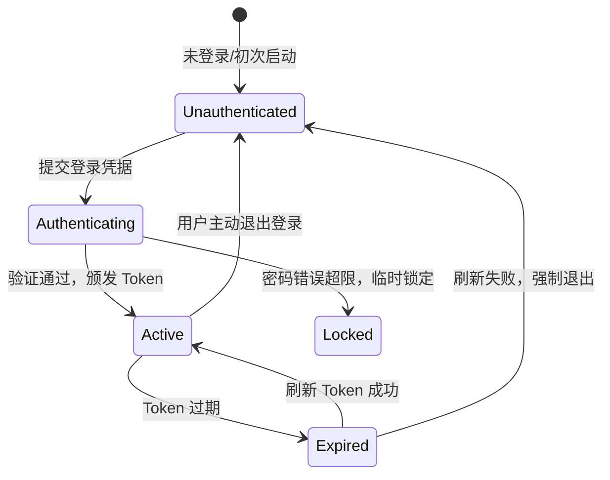

# 领域知识: 用户认证与账号体系 (Auth Domain)

> **领域定位**：负责用户的注册、登录、鉴权、会话管理以及与第三方登录渠道（如 Apple ID / Google / 微信）的集成。

---

## 1. 核心业务实体与术语字典 (Ubiquitous Language)

- **User / Profile**：系统核心用户身份实体，包含唯一的 `user_id`。
- **Session / Token**：表示用户与系统的有效交互会话凭证（包含 Access Token 与 Refresh Token）。
- **Role / Permissions**：用户角色（如普通用户、VIP 会员、管理员）及对应操作权限。

---

## 2. 状态机与生命周期 (State Machine & Lifecycle)

---

## 3. 业务流转与异常处理 (Business Flow & Edge Cases)

1. **登录与双向会话维持**：
   - 客户端在请求 Header 中携带 `Authorization: Bearer <token>`；
   - 服务端网关校验 Token 签名；
   - 遇到 401 Unauthorized，客户端尝试调用 Refresh Token 端点静默换票；换票失败则清理本地状态并跳转至登录页。
2. **账号安全与注销红线**：
   - 连续 5 次输错密码需触发人机验证或临时锁定 15 分钟；
   - 注销账号为不可逆操作，必须二次弹窗确认，并清理所有敏感个人数据（符合 GDPR / 应用商店合规要求）。

---

## 4. 对应代码与契约索引
- **核心接口**: `src/features/auth/interface/`
- **RPC 契约**: [docs/contracts/backend_rpc.md](../contracts/backend_rpc.md)
- **业务不变式**: [docs/invariants/business_invariants.md](../invariants/business_invariants.md)
