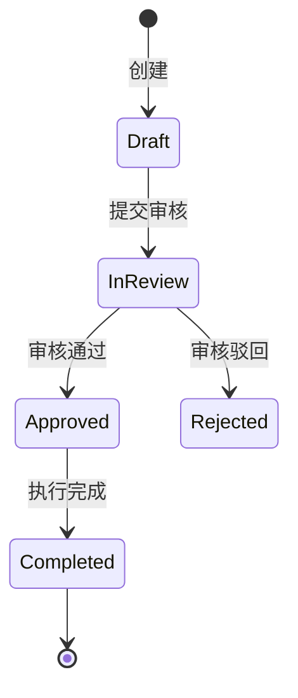

# 领域知识模版: [Domain Name]

> **领域定位**：简述该领域在整个业务版图中的定位与核心解决的问题。

---

## 1. 核心业务实体与术语字典 (Ubiquitous Language)
- **实体 A (Entity A)**：[定义与含义]
- **术语 B (Term B)**：[定义与含义]

---

## 2. 状态机与生命周期 (State Machine & Lifecycle)

---

## 3. 业务流转与异常处理 (Business Flow & Edge Cases)
1. **正常流转链路**：
   - 用户触发操作 -> 校验前置条件 -> 调用领域服务 -> 持久化落库 -> 触发事件通知。
2. **边缘与异常边界**：
   - 超时未响应时的降级策略；
   - 依赖外部服务失败时的补偿事务机制。

---

## 4. 对应代码与契约索引
- **核心接口**: `src/features/[domain]/interface/`
- **相关契约**: [docs/contracts/backend_rpc.md](../contracts/backend_rpc.md)
- **相关不变量**: [docs/invariants/business_invariants.md](../invariants/business_invariants.md)
